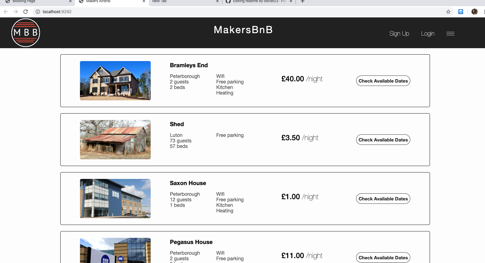

MakersBnB
===========

A practice group project based on Air BnB

## High level specifications

- Any signed-up user can list a new space.
- Users can list multiple spaces.
- Users should be able to name their space, provide a short description of the space, and a price per night.
- Users should be able to offer a range of dates where their space is available.
- Any signed-up user can request to hire any space for one night, and this should be approved by the user that owns that space.
- Nights for which a space has already been booked should not be available for users to book that space.
- Until a user has confirmed a booking request, that space can still be booked for that night.

## User Stories

- [x] As a user,
      I want to be able to sign up for MakersBnB,
      so that I can access the services of the site

- [x] As a user,
      I want to be able to log into MakersBnB,
      so that I can access my profile.

- [x] As a user,
      I want to be able to logout from MakersBnB,
      so I can protect the security of my account.

- [x] As a user,
      I want to be able to list a new space,
      so that I can rent it to others.

- [x] As a user,
      I want to be able to see available places,
      so that I can choose one to rent.

- [x] As a user,
      I want to be able to request to hire a place,
      so that I can stay there.

- [ ] As a user,
      I want to be able to see my booking requests, so that I can take relevant actions.

## Setup

- $ git clone https://github.com/thorpelawrence/makersbnb.git
- $ bundle install
- $ create:db makersbnb_test
- $ setup .ENV file (link in slack)

## Folder structure, models and libraries

root
|
|----coverage
|     
|----controllers
|
|----public
|      |--css
|      |--images
|
|----spec
|      |--features
|
|----db
      |-migrations
|
|
|----lib
|
|----views
```


## How to use

**Visit the homepage and click the sign up button**



**Once you signed up, choose the property you want to book and click Check Available Dates button**

